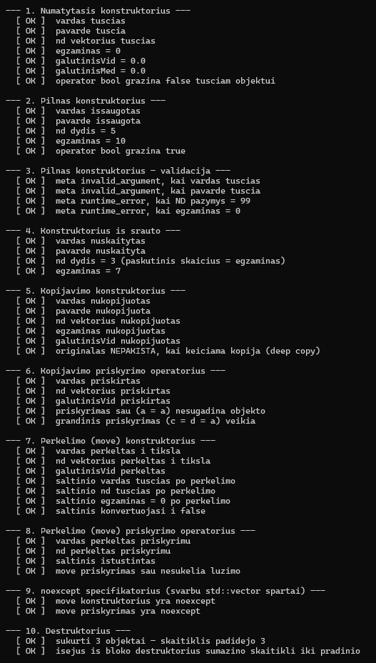
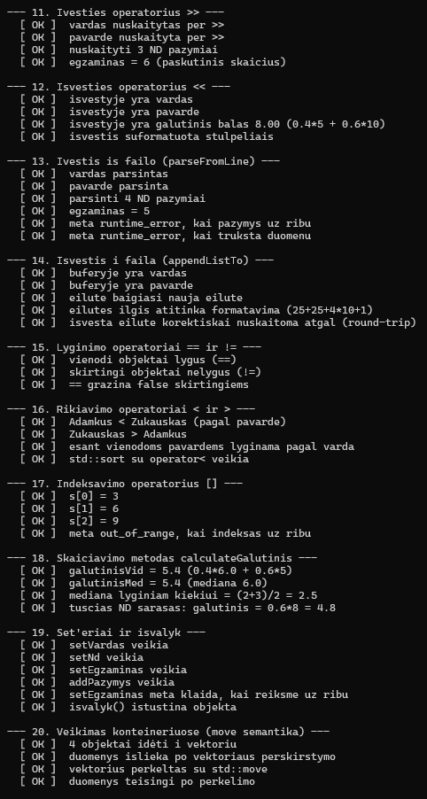
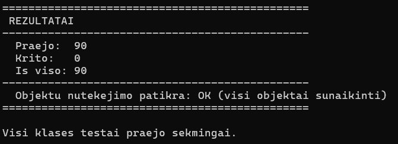

# Studentų Informacinė Sistema OOP_Marius_Augustinas
VU ISI Objektinio programavimo kurso laboratoriniai darbai

---

## Versijų istorija

| Versija | Pagrindiniai pakeitimai |
|---|---|
| **v0.1** | Pradinė realizacija — `std::vector`, rankinis įvedimas, vidurkio arba medianos skaičiavimas |
| **v0.2** | Failo skaitymas ir rašymas, rikiavimas, abu galutiniai balai skaičiuojami vienu metu |
| **v0.3** | Kodas suskaidytas į modulius (`*.h`/`*.cpp`), išimčių valdymas (`try`/`catch`) |
| **v0.4** | Studentų skirstymas į dvi grupes, spartos testavimas, failų generatorius |
| **v0.5** | Programa pertvarkyta į `template<typename Container>` — `vector`/`list`/`deque` |
| **v1.0** | Trijų skirstymo strategijų palyginimas, atminties analizė, `CMakeLists.txt` |
| **v1.1** | `struct studentas` → `class studentas`; I/O optimizacija; struct vs class ir optimizavimo flag'ų tyrimas |
| **v1.2** | Pilna **Rule of Five** realizacija, perdengti įvesties/išvesties ir pagalbiniai operatoriai, automatinis klasės metodų testas |

---

# v1.2 — Rule of Five ir perdengti operatoriai

## Techninė aplinka

| Parametras | Reikšmė |
|---|---|
| Procesorius | Intel Core i7-8565U (4 branduoliai / 8 gijų, iki 4.6 GHz) |
| RAM | 8 GB DDR4 |
| Saugykla | 250 GB SSD |
| OS | Windows 11 |
| Kompiliatorius | Visual Studio 2022, MSVC (`cl.exe`), x64 Release, `/std:c++17` |

---

## 1. Rule of Five — pilna realizacija

Taisyklė teigia: jei klasei reikia aiškiai apibrėžti bent vieną iš penkių specialiųjų funkcijų, greičiausiai reikia apibrėžti visas penkias. Visos jos realizuotos **pilnai** (ne `= default`), kad būtų galima jas demonstruoti ir testuoti.

### 1.1 Destruktorius

```cpp
studentas::~studentas()
{
    vardas_.clear();
    pavarde_.clear();
    nd_.clear();
    nd_.shrink_to_fit();      // faktiškai atlaisvina vektoriaus buferį
    egzaminas_ = 0;
    galutinisVid_ = 0.0;
    galutinisMed_ = 0.0;
    --gyvuObjektu;            // skaitiklis testavimui
}
```

`std::string` ir `std::vector` atlaisvina atmintį patys, todėl techniškai užtektų tuščio kūno. Pilna realizacija pateikta demonstravimo tikslais, o `gyvuObjektu` skaitiklis leidžia teste patikrinti, kad destruktorius **tikrai kviečiamas** kiekvienam objektui.

### 1.2 Kopijavimo konstruktorius

```cpp
studentas::studentas(const studentas& other)
    : vardas_(other.vardas_),
      pavarde_(other.pavarde_),
      nd_(other.nd_),
      egzaminas_(other.egzaminas_),
      galutinisVid_(other.galutinisVid_),
      galutinisMed_(other.galutinisMed_)
{
    ++gyvuObjektu;
}
```

Sukuriama **gili kopija** (deep copy) — `std::string` ir `std::vector` kopijuoja savo vidinius buferius, todėl objektai lieka visiškai nepriklausomi. Testas tai patikrina: pakeitus kopiją, originalas nepakinta.

### 1.3 Kopijavimo priskyrimo operatorius

```cpp
studentas& studentas::operator=(const studentas& other)
{
    if (this == &other)       // apsauga nuo priskyrimo sau
        return *this;

    vardas_ = other.vardas_;
    // ... likę laukai ...
    return *this;             // grąžina *this — veikia grandinė a = b = c
}
```

Patikra `this == &other` būtina: be jos priskyrimas `a = a` galėtų sugadinti duomenis. Grąžinama `*this` nuoroda, kad veiktų grandininis priskyrimas.

### 1.4 Perkėlimo (move) konstruktorius

```cpp
studentas::studentas(studentas&& other) noexcept
    : vardas_(std::move(other.vardas_)),
      pavarde_(std::move(other.pavarde_)),
      nd_(std::move(other.nd_)),
      egzaminas_(other.egzaminas_),
      galutinisVid_(other.galutinisVid_),
      galutinisMed_(other.galutinisMed_)
{
    other.egzaminas_ = 0;     // šaltinis paliekamas apibrėžtoje būsenoje
    other.galutinisVid_ = 0.0;
    other.galutinisMed_ = 0.0;
    ++gyvuObjektu;
}
```

Perimami vidiniai buferiai be kopijavimo. Šaltinio objektas paliekamas **galiojančioje, bet tuščioje** būsenoje — jį saugu naikinti arba priskirti iš naujo.

### 1.5 Perkėlimo (move) priskyrimo operatorius

```cpp
studentas& studentas::operator=(studentas&& other) noexcept
{
    if (this == &other)
        return *this;

    vardas_ = std::move(other.vardas_);
    // ... likę laukai ...
    other.egzaminas_ = 0;
    return *this;
}
```

### Kodėl `noexcept` yra kritiškai svarbus

`std::vector` perskirstymo metu (kai baigiasi `capacity`) turi perkelti visus elementus į naują atminties bloką. Jei move operacija **gali** mesti išimtį, vektorius negalėtų garantuoti stiprios išimčių saugos — pusiau perkelti duomenys būtų prarasti. Todėl `std::vector` naudoja `std::move_if_noexcept`: **be `noexcept` jis rinktųsi kopijavimo konstruktorių**, ir kiekvienas perskirstymas kopijuotų `std::string` ir `std::vector` buferius.

Testas tai patikrina statiškai:
```cpp
static_assert(std::is_nothrow_move_constructible<studentas>::value);
static_assert(std::is_nothrow_move_assignable<studentas>::value);
```

### Palyginimas su v1.1

| | v1.1 | v1.2 |
|---|---|---|
| Destruktorius | Generuojamas kompiliatoriaus | **Aiškiai apibrėžtas** su pilnu kūnu |
| Kopijavimo konstruktorius | Generuojamas | **Aiškiai apibrėžtas** |
| Kopijavimo priskyrimas | Generuojamas | **Aiškiai apibrėžtas** |
| Move konstruktorius | Generuojamas | **Aiškiai apibrėžtas**, `noexcept` |
| Move priskyrimas | Generuojamas | **Aiškiai apibrėžtas**, `noexcept` |
| Taisyklė | Rule of Zero | **Rule of Five** |

Svarbu suprasti pasekmę: v1.1 laikėsi Rule of Zero, ir kompiliatorius generavo visas penkias funkcijas. Vos tik v1.2 aiškiai deklaravome destruktorių, **kompiliatorius nustojo generuoti move operacijas** — jei jų nebūtume parašę rankiniu būdu, klasė būtų grįžusi prie kopijavimo, ir `std::sort` su 1M studentų sulėtėtų kelis kartus. Būtent todėl Rule of Five yra „viskas arba nieko" taisyklė.

---

## 2. Perdengti operatoriai

### 2.1 Įvesties ir išvesties operatoriai

| Operatorius | Paskirtis |
|---|---|
| `friend std::istream& operator>>(std::istream&, studentas&)` | Nuskaito studentą iš bet kokio įvesties srauto |
| `friend std::ostream& operator<<(std::ostream&, const studentas&)` | Išveda studentą į bet kokį išvesties srautą |

Abu paskelbti `friend`, nes jiems reikia prieigos prie privačių laukų, o pirmasis argumentas yra srautas, ne `studentas` — todėl jie negali būti klasės nariai.

**Kodėl tai svarbu naudotojui.** `std::istream` ir `std::ostream` yra bazinės klasės, todėl tie patys operatoriai veikia su:

| Srauto tipas | Panaudojimas |
|---|---|
| `std::cin` / `std::cout` | Interaktyvi įvestis ir išvestis į ekraną |
| `std::ifstream` / `std::ofstream` | Skaitymas ir rašymas į failą |
| `std::istringstream` / `std::ostringstream` | Darbas su eilutėmis atmintyje, testavimas |

```cpp
studentas s;
std::cin >> s;                    // iš klaviatūros
std::cout << s << "\n";           // į ekraną

std::ifstream f("studentai.txt");
f >> s;                           // iš failo

std::istringstream iss("Jonas Jonaitis 8 9 10 7");
iss >> s;                         // iš eilutės (naudojama testuose)
```

### 2.2 Duomenų įvesties būdai

Klasė palaiko **tris** įvesties būdus, kiekvienas su savo metodu:

| Būdas | Metodas | Kur naudojama |
|---|---|---|
| **Rankinis** (klaviatūra) | `operator>>` → `readStudentas(is)` | Meniu punktas 1 |
| **Automatinis** (generavimas) | Pilnas konstruktorius `studentas(vardas, pavarde, nd, egzaminas)` | Meniu punktai 2, 3, 5 |
| **Iš failo** | `parseFromLine(line, ndCount, lineNumber)` | Meniu punktas 4 |

**Kodėl failo skaitymui atskiras metodas.** `operator>>` naudoja `std::istringstream` ir `operator>>` skaičiams — su 10M studentų tai reiškia 10M srauto objektų konstravimų ir ~160M parsinimo operacijų su locale bei stream būsenos apdorojimu. `parseFromLine` dirba tiesiogiai su `const std::string&` ir naudoja `std::from_chars` (C++17), kuris parsina skaičių be jokio srauto mechanizmo.

```cpp
// Lėtas kelias (bet universalus):
std::istringstream ss(line);
studentas s;
ss >> s;

// Greitas kelias (failo skaitymui):
studentas s;
s.parseFromLine(line, ndCount, lineNumber);
```

### 2.3 Duomenų išvesties būdai

| Būdas | Metodas | Kur naudojama |
|---|---|---|
| **Į ekraną** | `operator<<` | `printStudentai` (meniu → konsolė) |
| **Į failą** (galutiniai balai) | `operator<<` | `writeStudentaiToFile` |
| **Į failą** (pilnas įrašas) | `appendListTo(std::string& out)` | `writeStudentaiListToFile` |

`appendListTo` nerašo į srautą — jis **prideda** suformatuotą eilutę į bendrą `std::string` buferį naudodamas `std::to_chars`. Failo rašymo funkcija kaupia eilutes, kol buferis pasiekia ~1 MB, tada iškviečia vieną `file.write()`. Taip vietoj 16M atskirų `<<` operacijų gaunama ~40 blokinių rašymų.

Buferis **neauga** proporcingai studentų skaičiui — `out.clear()` išlaiko `capacity`, todėl per visą rašymą nėra nė vienos naujos alokacijos.

### 2.4 Papildomi operatoriai būsimiems naudotojams

Šie operatoriai programoje nenaudojami, bet realizuoti, nes klasė gali būti naudojama kitur:

| Operatorius | Realizacija | Kam gali prireikti |
|---|---|---|
| `operator==` | Lygina vardą, pavardę, ND ir egzaminą | `std::find`, `std::unique`, `std::count` |
| `operator!=` | `!(*this == other)` | Sąlygos, algoritmai |
| `operator<` | Pagal pavardę, esant vienodoms — pagal vardą | `std::sort` be komparatoriaus, `std::set`, `std::map` |
| `operator>` | `other < *this` | Mažėjantis rikiavimas |
| `operator[]` | ND pažymys pagal indeksą, meta `std::out_of_range` | Patogi prieiga prie konkretaus darbo |
| `explicit operator bool` | Ar objektas turi vardą ir pavardę | `if (s) { ... }` patikros |

`operator bool` pažymėtas `explicit`, kad neįvyktų netyčinis konvertavimas į `int` — pvz. `s + 1` nesikompiliuos, kaip ir turi būti.

---

## 3. Klasės metodų testas

Testas realizuotas `testStudentas.h` / `testStudentas.cpp` ir iškviečiamas iš meniu **punktu 9**.

### Testavimo algoritmas

Naudojama paprasta `tikrink(sąlyga, aprašymas)` funkcija, kuri išveda `[ OK ]` arba `[KLAIDA]` ir skaičiuoja rezultatus. Kiekvienas testų skyrius tikrina vieną klasės aspektą.

### Testų apimtis

| Nr. | Skyrius | Ką tikrina |
|---|---|---|
| 1 | Numatytasis konstruktorius | Visi laukai inicijuoti nuliais / tuščiomis reikšmėmis |
| 2 | Pilnas konstruktorius | Duomenys išsaugoti teisingai |
| 3 | Pilnas konstruktorius — validacija | Meta `invalid_argument` tuščiam vardui, `runtime_error` blogiems pažymiams |
| 4 | Konstruktorius iš srauto | Nuskaito iš `std::istringstream` |
| 5 | **Kopijavimo konstruktorius** | Visi laukai nukopijuoti; pakeitus kopiją originalas **nepakinta** (deep copy) |
| 6 | **Kopijavimo priskyrimas** | Priskyrimas veikia; `a = a` nesugadina; `c = d = a` grandinė veikia |
| 7 | **Move konstruktorius** | Duomenys perkelti; šaltinis liko tuščias ir galiojantis |
| 8 | **Move priskyrimas** | Duomenys perkelti; `x = std::move(x)` nesukelia lūžimo |
| 9 | `noexcept` patikra | `is_nothrow_move_constructible` ir `is_nothrow_move_assignable` |
| 10 | **Destruktorius** | Objektų skaitiklis padidėja kuriant ir grįžta į pradinį išėjus iš bloko |
| 11 | **`operator>>`** | Nuskaito vardą, pavardę, ND ir egzaminą |
| 12 | **`operator<<`** | Išvestyje yra vardas, pavardė ir teisingas galutinis balas |
| 13 | **Įvestis iš failo** (`parseFromLine`) | Parsina teisingai; meta klaidas blogiems duomenims |
| 14 | **Išvestis į failą** (`appendListTo`) | Formatas teisingas; **round-trip** — išvesta eilutė nuskaitoma atgal |
| 15 | `operator==`, `operator!=` | Vienodi lygūs, skirtingi nelygūs |
| 16 | `operator<`, `operator>` | Rikiavimas pagal pavardę; veikia su `std::sort` |
| 17 | `operator[]` | Grąžina teisingą pažymį; meta `out_of_range` |
| 18 | `calculateGalutinis` | Vidurkis, mediana (lyginiam ir nelyginiam kiekiui), tuščias ND sąrašas |
| 19 | Set'eriai ir `isvalyk` | Reikšmės nustatomos; validacija veikia; objektas ištuštinamas |
| 20 | Veikimas konteineriuose | Duomenys išlieka po `vector` perskirstymo ir po `std::move` |

### Įdomiausi testai

**Deep copy patikra** (5 skyrius) — pakeičiama kopija ir tikrinama, ar originalas nepakito:
```cpp
studentas kopija(originalas);
kopija.setVardas("Pakeistas");
tikrink(originalas.vardas() == "Jonas",
    "originalas NEPAKISTA, kai keiciama kopija (deep copy)");
```

**Destruktoriaus patikra** (10 skyrius) — naudojamas statinis skaitiklis:
```cpp
const int priesBloka = studentas::gyvuObjektu;
{
    studentas a = kurkTestini();
    studentas b = kurkTestini();
    studentas c(a);
    tikrink(studentas::gyvuObjektu == priesBloka + 3, "sukurti 3 objektai");
}
tikrink(studentas::gyvuObjektu == priesBloka, "destruktorius sumazino skaitikli");
```

**Round-trip patikra** (14 skyrius) — svarbiausias I/O testas: išvedus studentą į buferį ir nuskaičius atgal, objektas turi būti identiškas:
```cpp
std::string buferis;
s.appendListTo(buferis);

studentas s2;
s2.parseFromLine(buferis, 3, 1);
tikrink(s2.vardas() == s.vardas() && s2.nd() == s.nd() &&
        s2.egzaminas() == s.egzaminas(),
    "isvesta eilute korektiskai nuskaitoma atgal (round-trip)");
```

Šis testas garantuoja, kad `writeStudentaiListToFile` sukurtas failas bus teisingai nuskaitytas `readStudentaiFromFile`.

**Objektų nutekėjimo patikra** — testo pabaigoje lyginamas `gyvuObjektu` skaitiklis prieš ir po visų testų. Jei skaičiai nesutampa, kažkur liko nesunaikintų objektų.

### Testo išvestis


*1 pav. Klasės metodų testo išvestis — konstruktoriai ir Rule of Five*


*2 pav. Klasės metodų testo išvestis — I/O operatoriai ir papildomi operatoriai*


*3 pav. Testo rezultatų santrauka su objektų nutekėjimo patikra*

---

## 4. Failų struktūra

```
.
├── LICENSE
├── README.md
├── docs/                           # Ekrano kopijos
├── OOP_2/                          # Programos failai
│   ├── studentas.h / studentas.cpp     # class studentas — Rule of Five, operatoriai, I/O
│   ├── testStudentas.h / .cpp          # Klasės metodų testas (v1.2)
│   ├── main.h                          # splitResult<T>, funkcijų deklaracijos
│   ├── OOP_2.cpp                       # main() + runProgram<Container>()
│   ├── menu.h / menu.cpp               # Meniu funkcijos
│   ├── enter.h / enter.cpp             # Rankinio įvedimo funkcijos
│   ├── generate.h / generate.cpp       # Generavimo funkcijos
│   ├── file.h / file.cpp               # Failo skaitymo ir rašymo šablonai
│   ├── calculate.h                     # calculateGalutinis<T>, sortStudentai<T>, splitStudentai<T>
│   ├── output.h                        # outputStudentai<T>
│   ├── print.h / print.cpp             # Spausdinimo funkcijos
│   └── test.h / test.cpp               # Spartos testavimo funkcijos
```

---

## 5. Naudojimosi instrukcija

### Paleidimas

```bash
.\programa.exe          # Windows
./programa              # Linux/Mac
```

### Pirmas ekranas — konteinerio pasirinkimas

```
Pasirinkite konteinerį:
1. vector
2. list
3. deque
```

### Meniu pasirinkimai

| Nr. | Veiksmas |
|---|---|
| 1 | Įvesti studentus ranka |
| 2 | Generuoti tik pažymius (vardai įvedami rankiniu būdu) |
| 3 | Generuoti studentus automatiškai |
| 4 | Nuskaityti iš failo |
| 5 | Generuoti testinį studentų failą |
| 6 | Spartos testas — failų kūrimas |
| 7 | Spartos testas — duomenų apdorojimas |
| 8 | Spartos testas — konteinerių palyginimas |
| **9** | **Klasės `studentas` metodų testavimas** *(nauja v1.2)* |
| 0 | Baigti |

### Failo formatas

```
Vardas                   Pavarde                         ND1       ND2  ...  Egzaminas
VardasNR1                PavardeNR1                        7         3  ...          5
```

Antraštė naudojama automatiškai nustatyti namų darbų stulpelių skaičių pagal `ND` žymėjimą.

---

## 6. Įdiegimo instrukcija

### Reikalavimai
- C++17 palaikantis kompiliatorius (MSVC 2019+, g++ 8+, clang++ 7+)
- CMake 3.16+

### CMake (visos OS)

```bash
mkdir build && cd build
cmake ..
cmake --build . --config Release
```

### g++ tiesiogiai

```bash
g++ -std=c++17 -O2 -Wall OOP_2.cpp studentas.cpp testStudentas.cpp menu.cpp enter.cpp generate.cpp file.cpp print.cpp test.cpp -o programa.exe
```

---

## 7. Pakeitimai v1.1 → v1.2

- Realizuota **pilna Rule of Five**: destruktorius, kopijavimo konstruktorius, kopijavimo priskyrimas, move konstruktorius (`noexcept`), move priskyrimas (`noexcept`) — visi su pilnais kūnais, ne `= default`
- Abi kopijavimo/perkėlimo priskyrimo operacijos turi **apsaugą nuo priskyrimo sau** (`this == &other`)
- Pridėtas statinis `gyvuObjektu` skaitiklis — leidžia testuose patikrinti destruktoriaus veikimą ir objektų nutekėjimą
- Perdengti papildomi operatoriai: `==`, `!=`, `<`, `>`, `[]`, `explicit operator bool`
- Pridėti individualūs set'eriai (`setVardas`, `setPavarde`, `setNd`, `setEgzaminas`, `addPazymys`) su validacija ir `isvalyk()` metodas
- Sukurtas `testStudentas.h` / `testStudentas.cpp` — **20 testų skyrių**, apimančių visus konstruktorius, visus penkis Rule of Five metodus, įvesties/išvesties operatorius ir papildomus operatorius
- Meniu papildytas **9 punktu** — klasės metodų testavimas
- Testuose realizuota **round-trip patikra**: išvesta eilutė nuskaitoma atgal ir lyginama su originalu
- Testuose realizuota **objektų nutekėjimo patikra** — skaitiklis prieš ir po visų testų