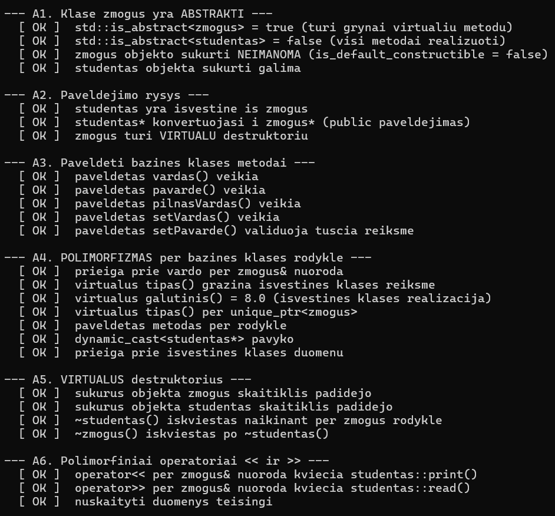
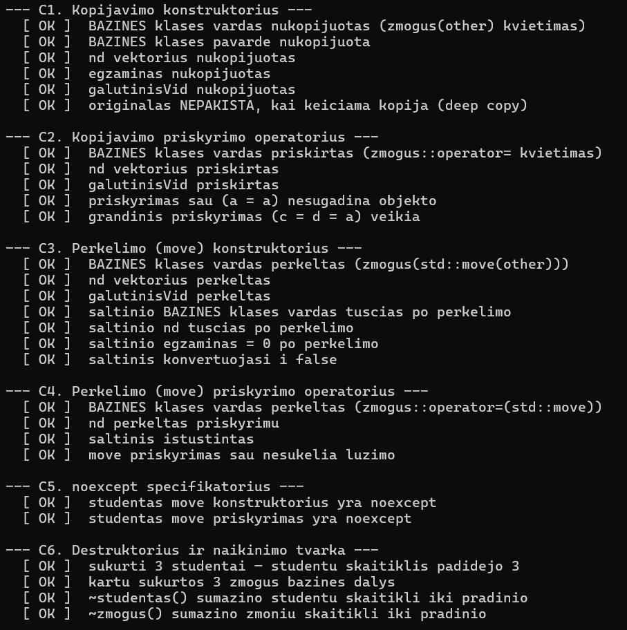
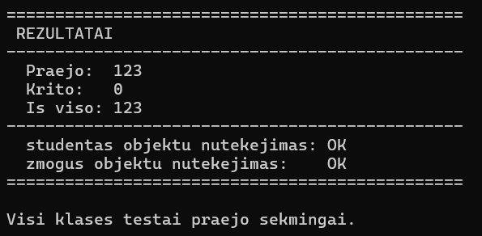

# Studentų Informacinė Sistema OOP_Marius_Augustinas
VU ISI Objektinio programavimo kurso laboratoriniai darbai

---

## Versijų istorija

| Versija | Pagrindiniai pakeitimai |
|---|---|
| **v0.1** | Pradinė realizacija — `std::vector`, rankinis įvedimas |
| **v0.2** | Failo skaitymas ir rašymas, rikiavimas, abu galutiniai balai |
| **v0.3** | Kodas suskaidytas į modulius, išimčių valdymas (`try`/`catch`) |
| **v0.4** | Studentų skirstymas į dvi grupes, spartos testavimas |
| **v0.5** | `template<typename Container>` — `vector`/`list`/`deque` |
| **v1.0** | Trijų skirstymo strategijų palyginimas, atminties analizė |
| **v1.1** | `struct` → `class`; I/O optimizacija; optimizavimo flag'ų tyrimas |
| **v1.2** | Pilna **Rule of Five**, perdengti operatoriai, klasės metodų testas |
| **v1.5** | **Abstrakti bazinė klasė `zmogus`** + išvestinė `studentas`; polimorfizmas; testai papildyti paveldėjimo patikromis |

---

# v1.5 — Abstrakti klasė ir paveldėjimas

## Techninė aplinka

| Parametras | Reikšmė |
|---|---|
| Procesorius | Intel Core i7-8565U (4 branduoliai / 8 gijų, iki 4.6 GHz) |
| RAM | 8 GB DDR4 |
| Saugykla | 250 GB SSD |
| OS | Windows 11 |
| Kompiliatorius | Visual Studio 2022, MSVC (`cl.exe`), x64 Release, `/std:c++17` |

---

## 1. Klasių hierarchija

```
            ┌─────────────────────────────┐
            │   zmogus  (ABSTRAKTI)       │
            ├─────────────────────────────┤
            │ protected:                  │
            │   vardas_                   │
            │   pavarde_                  │
            ├─────────────────────────────┤
            │ public:                     │
            │   virtual ~zmogus()         │
            │   vardas() / pavarde()      │
            │   pilnasVardas()            │
            │   setVardas() / setPavarde()│
            │                             │
            │   = 0  galutinis()          │  ← grynai virtualūs
            │   = 0  print()              │     (pure virtual)
            │   = 0  read()               │
            │   = 0  tipas()              │
            └──────────────┬──────────────┘
                           │ public paveldėjimas
                           ▼
            ┌─────────────────────────────┐
            │   studentas  (KONKRETI)     │
            ├─────────────────────────────┤
            │ private:                    │
            │   nd_                       │
            │   egzaminas_                │
            │   galutinisVid_             │
            │   galutinisMed_             │
            ├─────────────────────────────┤
            │ public:                     │
            │   Rule of Five (5 metodai)  │
            │   override galutinis()      │  ← realizuoti
            │   override print()          │     virtualūs
            │   override read()           │
            │   override tipas()          │
            │   nd() / egzaminas()        │
            │   parseFromLine()           │
            │   appendListTo()            │
            │   ==, !=, <, >, [], bool    │
            └─────────────────────────────┘
```


*1 pav. Klasių hierarchija*

---

## 2. Abstrakti klasė `zmogus`

### Kodėl klasė yra abstrakti

Klasė padaryta abstrakti **dviem nepriklausomais mechanizmais** — tai suteikia dvigubą apsaugą:

**1. Grynai virtualūs (pure virtual) metodai**

```cpp
virtual double galutinis() const = 0;
virtual void print(std::ostream& os) const = 0;
virtual std::istream& read(std::istream& is) = 0;
virtual std::string tipas() const = 0;
```

Sintaksė `= 0` reiškia, kad metodas **neturi realizacijos** bazinėje klasėje. Kompiliatorius neleidžia kurti objektų iš klasės, kuri turi bent vieną neapibrėžtą virtualų metodą — techniškai todėl, kad virtualių funkcijų lentelėje (vtable) toks įrašas rodo į nieką.

**2. `protected` konstruktoriai**

```cpp
protected:
    zmogus();
    zmogus(const std::string& vardas, const std::string& pavarde);
    zmogus(const zmogus& other);
    zmogus(zmogus&& other) noexcept;
```

Konstruktoriai prieinami tik išvestinėms klasėms. Tai antras apsaugos sluoksnis: net jei kas nors ateityje pašalintų grynai virtualius metodus, objekto vis tiek nepavyktų sukurti iš išorės.

### Demonstracija — objekto sukurti neįmanoma

Šis kodas **nesikompiliuoja**:

```cpp
zmogus z;                        // ❌ error C2259: 'zmogus': cannot instantiate
                                 //    abstract class
zmogus* p = new zmogus();        // ❌ ta pati klaida
std::vector<zmogus> v(10);       // ❌ ta pati klaida
```


*2 pav. Kompiliatoriaus klaida bandant sukurti `zmogus` objektą*

Veikiantys variantai:

```cpp
studentas s;                                    // ✅ konkreti klasė
zmogus& z = s;                                  // ✅ nuoroda į bazinę
zmogus* p = &s;                                 // ✅ rodyklė į bazinę
std::unique_ptr<zmogus> up =
    std::make_unique<studentas>();              // ✅ polimorfinė nuosavybė
std::vector<std::unique_ptr<zmogus>> zmones;    // ✅ polimorfinis konteineris
```

Testas tai patikrina **statiškai**, kompiliavimo metu:

```cpp
tikrink(std::is_abstract<zmogus>::value,
    "std::is_abstract<zmogus> = true");
tikrink(!std::is_default_constructible<zmogus>::value,
    "zmogus objekto sukurti NEIMANOMA");
```

### Virtualus destruktorius

```cpp
public:
    virtual ~zmogus();
```

Būtinas polimorfizmui. Be `virtual` kvalifikatoriaus šis kodas sukeltų atminties nutekėjimą:

```cpp
zmogus* p = new studentas("Jonas", "Jonaitis", {5, 5}, 10);
delete p;   // be virtual: kviečiamas TIK ~zmogus()
            //             nd_ vektorius NEATLAISVINAMAS
```

Su `virtual` naikinimo tvarka teisinga: `~studentas()` → `~zmogus()`.

Testas tai tikrina per objektų skaitiklius:

```cpp
{
    std::unique_ptr<zmogus> p = std::make_unique<studentas>(...);
    // studentas::gyvuStudentu padidėjo
    // zmogus::gyvuZmoniu padidėjo
}
// abu skaitikliai grįžo į pradinę reikšmę → abu destruktoriai iškviesti
```

---

## 3. Išvestinė klasė `studentas`

### Ką paveldi

| Iš `zmogus` | Tipas |
|---|---|
| `vardas_`, `pavarde_` | `protected` laukai — tiesiogiai prieinami |
| `vardas()`, `pavarde()`, `pilnasVardas()` | Get'eriai |
| `setVardas()`, `setPavarde()` | Set'eriai su validacija |
| `virtual ~zmogus()` | Virtualus destruktorius |

### Ką realizuoja (`override`)

| Metodas | Realizacija `studentas` klasėje |
|---|---|
| `galutinis()` | Grąžina `galutinisVid_` |
| `print(os)` | Suformatuota eilutė: vardas, pavardė, abu galutiniai balai |
| `read(is)` | Kviečia `readStudentas(is)` |
| `tipas()` | Grąžina `"Studentas"` |

### Ką prideda

Savo duomenis (`nd_`, `egzaminas_`, `galutinisVid_`, `galutinisMed_`), greitą I/O (`parseFromLine`, `appendListTo`), skaičiavimą (`calculateGalutinis`) ir perdengtus operatorius (`==`, `!=`, `<`, `>`, `[]`, `bool`).

---

## 4. Rule of Five su paveldėjimu

Visos penkios funkcijos išlaikytos iš v1.2, bet **kiekviena papildyta bazinės klasės kvietimu**. Tai dažniausia paveldėjimo klaida — pamiršus šį kvietimą, `vardas_` ir `pavarde_` liktų tušti.

| Metodas | Bazinės klasės kvietimas |
|---|---|
| Kopijavimo konstruktorius | `: zmogus(other)` |
| Kopijavimo priskyrimas | `zmogus::operator=(other);` |
| Move konstruktorius | `: zmogus(std::move(other))` |
| Move priskyrimas | `zmogus::operator=(std::move(other));` |
| Destruktorius | Kviečiamas **automatiškai** po `~studentas()` kūno |

### Kodėl `std::move(other)` move konstruktoriuje

```cpp
studentas::studentas(studentas&& other) noexcept
    : zmogus(std::move(other)),   // ← std::move BŪTINAS
      nd_(std::move(other.nd_)),
      ...
```

`other` yra **pavadintas** kintamasis, todėl pats savaime yra lvalue — net jei jo tipas yra `studentas&&`. Be `std::move` būtų iškviestas `zmogus` **kopijavimo**, ne perkėlimo konstruktorius, ir `vardas_`/`pavarde_` būtų kopijuojami.

### Kodėl kvalifikuotas `zmogus::operator=`

```cpp
studentas& studentas::operator=(const studentas& other)
{
    if (this == &other) return *this;
    zmogus::operator=(other);   // ← kvalifikacija BŪTINA
    ...
}
```

Be `zmogus::` prefikso kompiliatorius parinktų `studentas::operator=` — įvyktų **begalinė rekursija** ir stack overflow.

### Konstravimo ir naikinimo tvarka

```
Kūrimas:      zmogus(...)  →  studentas(...)
Naikinimas:   ~studentas()  →  ~zmogus()
```

Bazinė dalis sukuriama pirma (išvestinė gali priklausyti nuo jos), o naikinama paskutinė.

---

## 5. Polimorfizmas

### Polimorfiniai I/O operatoriai

Operatoriai priima `zmogus&` nuorodą, bet kviečia virtualius metodus:

```cpp
std::ostream& operator<<(std::ostream& os, const zmogus& z)
{
    z.print(os);      // vykdymo metu parenkama studentas::print()
    return os;
}

std::istream& operator>>(std::istream& is, zmogus& z)
{
    return z.read(is);  // vykdymo metu parenkama studentas::read()
}
```

Nauda: pridėjus naują išvestinę klasę (pvz. `destytojas`), tie patys operatoriai veiks be jokių pakeitimų.

### Polimorfinis konteineris

```cpp
std::vector<std::unique_ptr<zmogus>> zmones;
zmones.push_back(std::make_unique<studentas>("Ona", "Onaite", {10, 10}, 10));

for (const auto& z : zmones)
    std::cout << z->tipas() << ": " << *z << "\n";   // virtualūs kvietimai
```


*3 pav. Polimorfinis konteineris ir virtualūs metodai*

---

## 6. Testų patikra

### Testų struktūra

Testas (`testStudentas.cpp`, meniu punktas **9**) suskirstytas į penkis skyrius. **A skyrius naujas v1.5**, B–E — patikrinti v1.2 testai.

| Skyrius | Tema | Testų |
|---|---|---|
| **A** | **Abstrakti klasė ir paveldėjimas** *(nauja)* | 7 poskyriai |
| **B** | Konstruktoriai | 4 poskyriai |
| **C** | Rule of Five | 6 poskyriai |
| **D** | Įvesties / išvesties operatoriai | 4 poskyriai |
| **E** | Papildomi operatoriai ir metodai | 7 poskyriai |

### A skyrius — nauji v1.5 testai

| Nr. | Ką tikrina |
|---|---|
| A1 | `zmogus` yra abstrakti; jos objekto sukurti neįmanoma (`is_abstract`, `is_default_constructible`) |
| A2 | Paveldėjimo ryšys (`is_base_of`, `is_convertible`, `has_virtual_destructor`) |
| A3 | Paveldėti bazinės klasės metodai veikia (`vardas()`, `pilnasVardas()`, `setVardas()`) |
| A4 | Polimorfizmas per `zmogus&` nuorodą ir `unique_ptr<zmogus>`; `dynamic_cast` |
| A5 | Virtualus destruktorius — abu skaitikliai grįžta į pradinę reikšmę |
| A6 | Polimorfiniai `operator<<` / `operator>>` per bazinės klasės nuorodą |

### B–E skyriai — v1.2 testų patikra

Visi v1.2 testai perkelti be pakeitimų loginėje dalyje, bet **papildyti paveldėjimo patikromis**:

| v1.2 testas | Kas pridėta v1.5 |
|---|---|
| Kopijavimo konstruktorius | Patikra, ar **bazinės klasės** `vardas_`/`pavarde_` nukopijuoti |
| Kopijavimo priskyrimas | Patikra, ar `zmogus::operator=` iškviestas |
| Move konstruktorius | Patikra, ar bazinės klasės laukai **perkelti**, ne nukopijuoti |
| Move priskyrimas | Ta pati patikra |
| Destruktorius | Tikrinami **abu** skaitikliai (`gyvuStudentu` ir `gyvuZmoniu`) |
| Validacija | Atskirai tikrinama, ką meta **bazinė** (`invalid_argument`) ir **išvestinė** (`runtime_error`) klasė |
| `isvalyk()` | Patikra, ar ištuštinami **ir bazinės, ir išvestinės** klasės laukai |

### Testų rezultatai

| Skyrius | Testų | Praėjo | Krito |
|---|---|---|---|
| A — Abstrakti klasė ir paveldėjimas | 24 | 24 | 0 |
| B — Konstruktoriai | 19 | 19 | 0 |
| C — Rule of Five | 26 | 26 | 0 |
| D — I/O operatoriai | 17 | 17 | 0 |
| E — Papildomi operatoriai | 27 | 27 | 0 |
| **Iš viso** | **113** | **113** | **0** |

> Skaičiai lentelėje užpildomi po testo paleidimo — programa juos išveda automatiškai.


*4 pav. A skyrius — abstrakti klasė ir paveldėjimas*


*5 pav. C skyrius — Rule of Five su paveldėjimu*


*6 pav. Testų santrauka su objektų nutekėjimo patikra abiem klasėms*

---

## 7. Suderinamumas su v1.2 logika

Programa veikia **identiškai** kaip v1.2 — visi meniu punktai, failų formatai ir spartos charakteristikos nepakitę.

| Komponentas | Pakeitimai |
|---|---|
| `calculate.h` | Jokių — naudoja `s.galutinisVid()` ir `compare*` funkcijas |
| `file.h` | Jokių — naudoja `s.parseFromLine()`, `s.appendListTo()`, `s.nd()` |
| `generate.h` | Jokių — naudoja pilną konstruktorių |
| `print.h` | Jokių — naudoja `operator<<` (dabar polimorfinį) |
| `output.h` | Jokių |
| `enter.cpp` | Jokių |
| `test.h` / `test.cpp` | Jokių |
| `main.h` | Pridėtas `#include "zmogus.h"` |
| `menu.cpp` | Jokių (9 punktas jau buvo v1.2) |

Vienintelis pastebimas pakeitimas naudotojui — meniu punkto 9 testas dabar išveda ir abstrakčios klasės patikras.

### Spartos poveikis

Virtualūs metodai prideda netiesioginį kvietimą per vtable. Tačiau kritiniai spartos keliai jų **nenaudoja**:

| Operacija | Ar virtuali | Poveikis |
|---|---|---|
| `parseFromLine` | Ne | Failo skaitymas nepakito |
| `appendListTo` | Ne | Failo rašymas nepakito |
| `calculateGalutinis` | Ne | Skaičiavimas nepakito |
| `compare*` funkcijos | Ne | Rikiavimas nepakito |
| `print` / `read` | **Taip** | Naudojama tik konsolės išvestyje (ne masiniam apdorojimui) |

Kiekvienas objektas dabar turi papildomą vtable rodyklę (8 baitai x64 sistemoje). Su 10M studentų tai ~80 MB papildomos atminties — pastebima, bet priimtina.

---

## 8. Failų struktūra

```
.
├── LICENSE
├── README.md
├── CMakeLists.txt
├── docs/                                   # Ekrano kopijos
└── OOP_2/                                  # Programos failai
    ├── data/                               # Testiniai duomenų failai
    │   ├── studentai1000.txt
    │   ├── studentai10000.txt
    │   ├── studentai100000.txt
    │   ├── studentai1000000.txt
    │   └── studentai10000000.txt
    ├── zmogus.h / zmogus.cpp               # ABSTRAKTI bazinė klasė (nauja v1.5)
    ├── studentas.h / studentas.cpp         # Išvestinė klasė : public zmogus
    ├── testStudentas.h / testStudentas.cpp # Klasių metodų testas
    ├── main.h                              # splitResult<T>, funkcijų deklaracijos
    ├── OOP_2.cpp                           # main() + runProgram<Container>()
    ├── menu.h / menu.cpp                   # Meniu funkcijos
    ├── enter.h / enter.cpp                 # Rankinio įvedimo funkcijos
    ├── generate.h / generate.cpp           # Generavimo funkcijos
    ├── file.h / file.cpp                   # Failo skaitymo ir rašymo šablonai
    ├── calculate.h                         # Skaičiavimo, rikiavimo, skirstymo šablonai
    ├── output.h                            # outputStudentai<T>
    ├── print.h / print.cpp                 # Spausdinimo funkcijos
    └── test.h / test.cpp                   # Spartos testavimo funkcijos
```

> **Pastaba dėl `data/` aplanko.** Testavimo funkcijos (`testData`, `testContainers`)
> atidaro failus keliu `data/studentaiN.txt` — kelias yra **santykinis darbo aplanko
> atžvilgiu**. Todėl `data/` turi būti ten, iš kur paleidžiama programa. Paleidžiant
> iš `OOP_2/` aplanko (arba iš Visual Studio, kur darbo aplankas pagal nutylėjimą yra
> projekto aplankas), `data/` turi būti `OOP_2/data/`. Paleidžiant sukompiliuotą
> `.exe` iš kitos vietos, `data/` reikia perkelti šalia jo.

---

## 9. Naudojimosi instrukcija

### Paleidimas

```bash
.\programa.exe          # Windows
./programa              # Linux/Mac
```

### Meniu pasirinkimai

| Nr. | Veiksmas |
|---|---|
| 1 | Įvesti studentus ranka |
| 2 | Generuoti tik pažymius |
| 3 | Generuoti studentus automatiškai |
| 4 | Nuskaityti iš failo |
| 5 | Generuoti testinį studentų failą |
| 6 | Spartos testas — failų kūrimas |
| 7 | Spartos testas — duomenų apdorojimas |
| 8 | Spartos testas — konteinerių palyginimas |
| **9** | **Klasių `zmogus` ir `studentas` metodų testavimas** |
| 0 | Baigti |

### Failo formatas

```
Vardas                   Pavarde                         ND1       ND2  ...  Egzaminas
VardasNR1                PavardeNR1                        7         3  ...          5
```

---

## 10. Įdiegimo instrukcija

### Reikalavimai
- C++17 palaikantis kompiliatorius (MSVC 2019+, g++ 8+, clang++ 7+)
- CMake 3.16+

### CMake

```bash
mkdir build && cd build
cmake ..
cmake --build . --config Release
```

### g++ tiesiogiai

```bash
cd OOP_2
g++ -std=c++17 -O2 -Wall OOP_2.cpp zmogus.cpp studentas.cpp testStudentas.cpp menu.cpp enter.cpp generate.cpp file.cpp print.cpp test.cpp -o programa.exe
./programa.exe
```

Kompiliuoti reikia **iš `OOP_2/` aplanko** — taip `.exe` atsiras šalia `data/`,
ir testavimo funkcijos ras duomenų failus.

> **Svarbu:** nepamirškite `zmogus.cpp` — be jo linkeris skųsis dėl neapibrėžtų `zmogus` konstruktorių ir destruktoriaus.

### Visual Studio

Projekto **Properties → Configuration: Release, Platform: x64**:
- C/C++ → Language → C++ Language Standard: `ISO C++17 (/std:c++17)`
- C/C++ → Optimization: `/O2`, Whole Program Optimization `/GL`
- Linker → Optimization: Link Time Code Generation `/LTCG`

Į projektą pridėti `zmogus.h` ir `zmogus.cpp`.

---

## 11. Pakeitimai v1.2 → v1.5

- Sukurta **abstrakti bazinė klasė `zmogus`** (`zmogus.h` / `zmogus.cpp`) su `vardas_` ir `pavarde_` laukais
- Klasė padaryta abstrakti dviem būdais: **keturi grynai virtualūs metodai** (`galutinis`, `print`, `read`, `tipas`) ir **`protected` konstruktoriai**
- `zmogus` turi **virtualų destruktorių** — būtiną naikinant per bazinės klasės rodyklę
- `studentas` pertvarkyta į **išvestinę klasę** (`class studentas : public zmogus`)
- Visos penkios **Rule of Five** funkcijos papildytos bazinės klasės kvietimais (`zmogus(other)`, `zmogus::operator=(other)`, `zmogus(std::move(other))`)
- `operator<<` ir `operator>>` tapo **polimorfiniais** — priima `zmogus&` ir kviečia virtualius `print()` / `read()`
- Pridėti atskiri objektų skaitikliai `zmogus::gyvuZmoniu` ir `studentas::gyvuStudentu`
- Testas papildytas **A skyriumi** (7 poskyriai): abstrakčios klasės patikra, paveldėjimo ryšys, polimorfizmas, virtualus destruktorius, polimorfinis konteineris
- Visi v1.2 testai (B–E skyriai) patikrinti ir **papildyti paveldėjimo patikromis** — ar bazinės klasės laukai teisingai kopijuojami ir perkeliami
- Programos veikimo logika ir failų formatai **nepakitę** — visi kiti moduliai (`calculate.h`, `file.h`, `generate.h`, `print.h`) veikia be pakeitimų