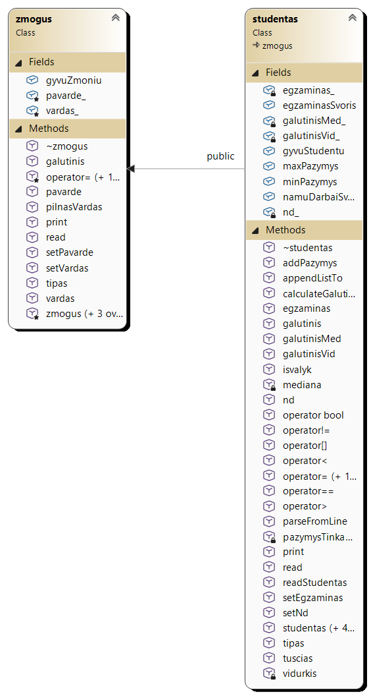
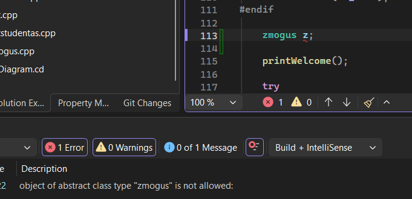
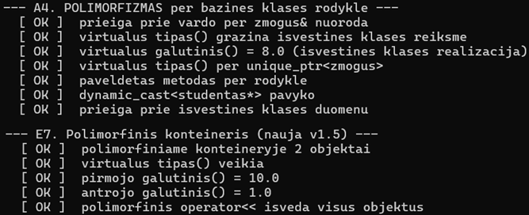
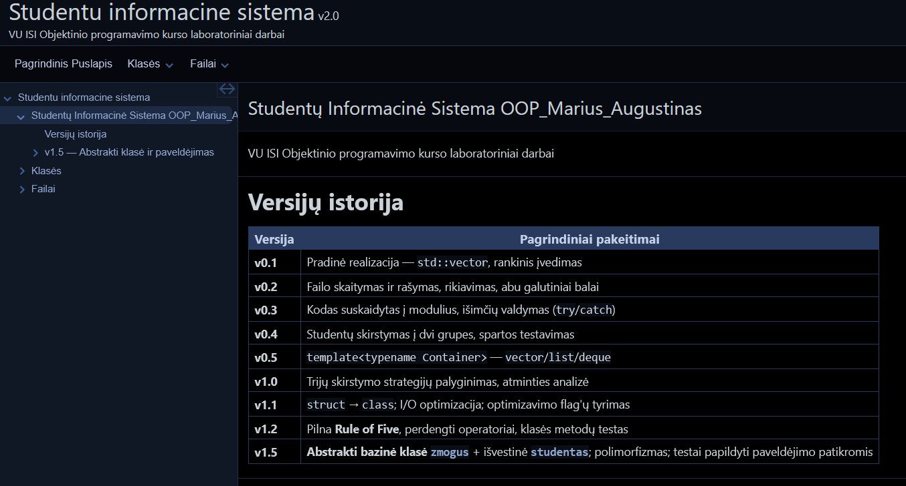
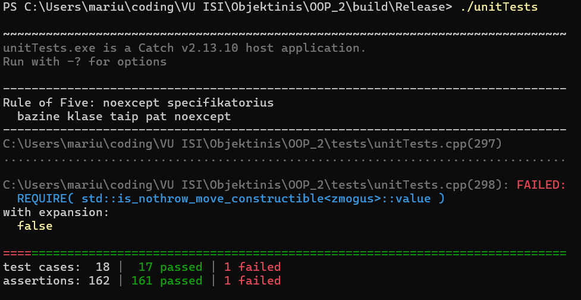

# Studentų Informacinė Sistema

**OOP_Marius_Augustinas** · VU ISI Objektinio programavimo kurso laboratoriniai darbai

C++ programa studentų duomenims įvesti, saugoti, apdoroti ir analizuoti. Palaiko tris STL konteinerius, tris duomenų įvesties būdus, studentų skirstymą į kategorijas ir spartos tyrimus su dideliais duomenų kiekiais.

---

## Turinys

1. [Versijų istorija](#1-versijų-istorija)
2. [Naudojimosi instrukcija](#2-naudojimosi-instrukcija)
3. [Įdiegimo instrukcija](#3-įdiegimo-instrukcija)
4. [Klasių architektūra](#4-klasių-architektūra)
5. [Dokumentacija](#5-dokumentacija)
6. [Unit testai](#6-unit-testai)
7. [Spartos tyrimai](#7-spartos-tyrimai)
8. [Failų struktūra](#8-failų-struktūra)

---

## 1. Versijų istorija

| Versija | Pagrindiniai pakeitimai |
|---|---|
| **v0.1** | Pradinė realizacija — `std::vector`, rankinis įvedimas, vidurkio arba medianos skaičiavimas |
| **v0.2** | Failo skaitymas ir rašymas, rikiavimas, abu galutiniai balai skaičiuojami vienu metu |
| **v0.3** | Kodas suskaidytas į modulius (`*.h`/`*.cpp`), išimčių valdymas (`try`/`catch`) |
| **v0.4** | Studentų skirstymas į dvi grupes, spartos testavimas, failų generatorius |
| **v0.5** | Programa pertvarkyta į `template<typename Container>` — `vector`/`list`/`deque` |
| **v1.0** | Trijų skirstymo strategijų palyginimas, atminties analizė, `CMakeLists.txt` |
| **v1.1** | `struct studentas` → `class studentas`; I/O optimizacija; struct vs class tyrimas |
| **v1.2** | Pilna **Rule of Five**, perdengti operatoriai, rankinis klasės metodų testas |
| **v1.5** | **Abstrakti bazinė klasė `zmogus`** + išvestinė `studentas`; polimorfizmas |
| **v2.0** | **Doxygen dokumentacija** (HTML + LaTeX + PDF), **Catch2 unit testai**, švari repozitorija |

---

## 2. Naudojimosi instrukcija

### Paleidimas

```bash
.\programa.exe          # Windows
./programa              # Linux/Mac
```

### Pirmas ekranas — konteinerio pasirinkimas

```
Pasirinkite konteinerį:
1. vector
2. list
3. deque
```

Pasirinkimas galioja visai sesijai. Norint pakeisti — paleisti programą iš naujo.

### Meniu

| Nr. | Veiksmas | Ką daro |
|---|---|---|
| 1 | Įvesti studentus ranka | Klausia vardo, pavardės, pažymių po vieną |
| 2 | Generuoti tik pažymius | Vardai įvedami ranka, pažymiai atsitiktiniai |
| 3 | Generuoti studentus | Šabloniniai vardai (`VardasNR1`) ir atsitiktiniai pažymiai |
| 4 | Nuskaityti iš failo | Klausia failo pavadinimo su `.txt` plėtiniu |
| 5 | Generuoti studentų failą | Sukuria testinį failą su nurodytu įrašų skaičiumi |
| 6 | Failų kūrimo testas | 1 tyrimas — matuoja failo rašymo spartą |
| 7 | Duomenų apdorojimo testas | 2 tyrimas — matuoja visus apdorojimo žingsnius |
| 8 | Konteinerių palyginimas | 3 tyrimas — lygina `vector`, `list`, `deque` |
| 9 | Klasių metodų testas | Rankinis `zmogus` ir `studentas` metodų patikrinimas |
| 0 | Baigti darbą | |

### Tipinė darbo eiga

```
1. Paleisti programą           → pasirinkti konteinerį (1 = vector)
2. Meniu punktas 5             → sugeneruoti failą (pvz. 100000 įrašų)
3. Meniu punktas 4             → nuskaityti tą failą
4. Pasirinkti rikiavimo būdą   → pvz. 4 (pagal medianą)
5. Pasirinkti išvesties formatą → 1 (konsolė) arba 2 (failas)
```

Rezultate studentai suskirstomi į dvi grupes: **kietiakai** (galutinis ≥ 5.0) ir **vargsiukai** (galutinis < 5.0).

### Duomenų failo formatas

```
Vardas                   Pavarde                         ND1       ND2  ...  Egzaminas
VardasNR1                PavardeNR1                        7         3  ...          5
VardasNR2                PavardeNR2                        9         1  ...          8
```

Antraštė naudojama automatiškai nustatyti namų darbų stulpelių skaičių pagal `ND` žymėjimą — todėl failai su skirtingu pažymių kiekiu nuskaitomi be jokių pakeitimų kode.

### Įvesties validacija

| Tikrinama | Reakcija |
|---|---|
| Vardas / pavardė tuščia arba su skaičiais | Kartojamas klausimas |
| Pažymys ne tarp 1 ir 10 | Kartojamas klausimas (interaktyviai) arba `std::runtime_error` (iš failo) |
| Failo pavadinimas be `.txt` | Kartojamas klausimas |
| Failas neegzistuoja | `std::runtime_error` su failo pavadinimu |
| Meniu pasirinkimas už ribų | Kartojamas klausimas |

---

## 3. Įdiegimo instrukcija

### Reikalavimai

| Įrankis | Versija | Būtinas |
|---|---|---|
| C++ kompiliatorius | MSVC 2019+, g++ 8+, clang++ 7+ (C++17) | Taip |
| CMake | 3.16+ | Rekomenduojama |
| Catch2 | v2.13.x (`catch.hpp`) | Unit testams |
| Doxygen | 1.9+ | Dokumentacijai |
| Graphviz | bet kokia | Diagramoms dokumentacijoje |
| TeX Live / MiKTeX | bet kokia | PDF generavimui |

### Variantas A — CMake (rekomenduojama)

```bash
git clone <repozitorijos-adresas>
cd OOP_Marius_Augustinas

mkdir build && cd build
cmake ..
cmake --build . --config Release
```

Rezultatas:
- `programa` (arba `programa.exe`) — pagrindinė programa
- `unitTests` — unit testai (jei rastas `tests/catch.hpp`)
- `data/` aplankas nukopijuojamas automatiškai šalia vykdomojo failo

### Variantas B — g++ tiesiogiai

```bash
cd OOP_2
g++ -std=c++17 -O2 -Wall \
    OOP_2.cpp zmogus.cpp studentas.cpp testStudentas.cpp \
    menu.cpp enter.cpp generate.cpp file.cpp print.cpp test.cpp \
    -o programa.exe
./programa.exe
```

Kompiliuoti reikia **iš `OOP_2/` aplanko** — taip vykdomasis failas atsiranda šalia `data/`, ir testavimo funkcijos randa duomenų failus.

### Variantas C — Visual Studio

CMake projektą galima atidaryti tiesiogiai: **File → Open → CMake** → pasirinkti `CMakeLists.txt`.

Rankiniam projektui — **Properties → Configuration: Release, Platform: x64**:

| Nustatymas | Reikšmė |
|---|---|
| C/C++ → Language → C++ Language Standard | `ISO C++17 (/std:c++17)` |
| C/C++ → Optimization → Optimization | `/O2` |
| C/C++ → Optimization → Whole Program Optimization | `/GL` |
| Linker → Optimization → Link Time Code Generation | `/LTCG` |
| Debugging → Working Directory | `$(ProjectDir)` |

> **Pastaba dėl `/O3`:** MSVC tokio flag'o **neturi** — jo skalė yra `/Od` → `/O1` → `/O2`, kur `/O2` yra maksimalus lygis. GCC/Clang atitikmuo — `-O2`.

### Unit testų paruošimas

```bash
mkdir -p tests
curl -L -o tests/catch.hpp \
  https://github.com/catchorg/Catch2/releases/download/v2.13.10/catch.hpp
```

Be `tests/catch.hpp` CMake parodys įspėjimą ir praleis testų taikinį — pagrindinė programa vis tiek sukompiliuos.

---

## 4. Klasių architektūra

```
            ┌─────────────────────────────┐
            │   zmogus  (ABSTRAKTI)       │
            ├─────────────────────────────┤
            │ protected:                  │
            │   vardas_ , pavarde_        │
            │   konstruktoriai            │
            ├─────────────────────────────┤
            │ public:                     │
            │   virtual ~zmogus()         │
            │   vardas() / pavarde()      │
            │   pilnasVardas()            │
            │   setVardas() / setPavarde()│
            │                             │
            │   = 0  galutinis()          │  ← grynai virtualūs
            │   = 0  print()              │
            │   = 0  read()               │
            │   = 0  tipas()              │
            └──────────────┬──────────────┘
                           │ public paveldėjimas
                           ▼
            ┌─────────────────────────────┐
            │   studentas  (KONKRETI)     │
            ├─────────────────────────────┤
            │ private:                    │
            │   nd_ , egzaminas_          │
            │   galutinisVid_             │
            │   galutinisMed_             │
            ├─────────────────────────────┤
            │ public:                     │
            │   Rule of Five (5 metodai)  │
            │   override × 4              │
            │   parseFromLine()           │
            │   appendListTo()            │
            │   ==, !=, <, >, [], bool    │
            └─────────────────────────────┘
```


*1 pav. Klasių hierarchija (Visual Studio Class Designer)*

### Abstrakti klasė `zmogus`

Klasė padaryta abstrakti **dviem nepriklausomais mechanizmais**:

1. **Keturi grynai virtualūs metodai** — `galutinis()`, `print()`, `read()`, `tipas()`
2. **`protected` konstruktoriai** — prieinami tik išvestinėms klasėms

Objekto sukurti neįmanoma:
```cpp
zmogus z;                     // error C2259: cannot instantiate abstract class
zmogus* p = new zmogus();     // ta pati klaida
```


*2 pav. Kompiliatoriaus klaida bandant sukurti `zmogus` objektą*

### Rule of Five su paveldėjimu

Kiekviena iš penkių funkcijų **privalo** iškviesti atitinkamą bazinės klasės funkciją:

| Metodas | Bazinės klasės kvietimas | Kas nutiktų be jo |
|---|---|---|
| Kopijavimo konstruktorius | `: zmogus(other)` | Vardas ir pavardė liktų tušti |
| Kopijavimo priskyrimas | `zmogus::operator=(other);` | Bazinė dalis nepasikeistų |
| Move konstruktorius | `: zmogus(std::move(other))` | Bazinė dalis būtų kopijuojama |
| Move priskyrimas | `zmogus::operator=(std::move(other));` | Ta pati problema |
| Destruktorius | Kviečiamas automatiškai | — |

Trys subtilumai, kurių kompiliatorius nepagaus:

**`std::move(other)` move konstruktoriuje.** `other` yra pavadintas kintamasis, todėl pats savaime lvalue — net jei jo tipas `studentas&&`. Be `std::move` būtų iškviestas `zmogus` **kopijavimo** konstruktorius.

**Kvalifikuotas `zmogus::operator=`.** Be `zmogus::` prefikso kompiliatorius parinktų `studentas::operator=` — įvyktų begalinė rekursija.

**`noexcept` move operacijose.** `std::vector` perskirstymo metu naudoja `std::move_if_noexcept` — be `noexcept` jis renkasi kopijavimo konstruktorių, ir sparta krenta kelis kartus.

### Polimorfizmas

`operator<<` ir `operator>>` priima `zmogus&` ir kviečia virtualius `print()` / `read()`:

```cpp
std::vector<std::unique_ptr<zmogus>> zmones;
zmones.push_back(std::make_unique<studentas>("Ona", "Onaite", {10, 10}, 10));

for (const auto& z : zmones)
    std::cout << z->tipas() << ": " << *z << "\n";
```

Pridėjus naują išvestinę klasę ateityje, tie patys operatoriai veiks be pakeitimų.


*3 pav. Polimorfinis konteineris ir virtualūs metodai*

---

## 5. Dokumentacija

Dokumentacija generuojama **Doxygen** įrankiu iš kodo komentarų.

### Generavimas

```bash
doxygen Doxyfile
```

Arba per CMake:
```bash
cmake --build build --target docs
```

### Rezultatas

| Formatas | Vieta | Kaip atidaryti |
|---|---|---|
| **HTML** | `docs/doxygen/html/` | Naršyklėje atidaryti `index.html` |
| **LaTeX** | `docs/doxygen/latex/` | Šaltiniai PDF generavimui |
| **PDF** | `docs/doxygen/refman.pdf` | Bet kokiu PDF skaitytuvu |


*4 pav. Sugeneruota HTML dokumentacija su paveldėjimo diagrama*

### PDF generavimas

Jei įdiegtas TeX Live arba MiKTeX:
```bash
cd docs/doxygen/latex
make.bat        # Windows
```

### Kas dokumentuota

| Elementas | Aprašyta |
|---|---|
| Klasės `zmogus`, `studentas` | Paskirtis, paveldėjimo ryšys, naudojimo pavyzdžiai |
| Visi konstruktoriai | Parametrai, metamos išimtys |
| **Rule of Five metodai** | Kodėl reikia bazinės klasės kvietimo, kodėl `noexcept` |
| Įvesties/išvesties metodai | Formatai, skirtumas tarp greito ir universalaus varianto |
| Perdengti operatoriai | Kam gali prireikti būsimiems naudotojams |
| Šablonai (`calculate.h`, `file.h`) | Kaip veikia su skirtingais konteineriais |

Naudojamos Doxygen žymos: `@file`, `@class`, `@brief`, `@param`, `@return`, `@throws`, `@note`, `@warning`, `@see`, `@code`/`@endcode`, `@par`, taip pat grupavimas su `@name` / `@{` / `@}`.

---

## 6. Unit testai

### Kam jie reikalingi

Programoje jau yra rankinis testas (meniu punktas 9), bet jis reikalauja paleisti programą ir žiūrėti į konsolę. Unit testai sprendžia tris problemas:

| Problema | Sprendimas |
|---|---|
| **Regresijos** — pataisius vieną vietą sugenda kita | Testai paleidžiami po kiekvieno pakeitimo ir iškart parodo, kas sulūžo |
| **Tylios klaidos** — kodas kompiliuojasi, bet veikia neteisingai | Rule of Five klaidos būtent tokios: pamiršus `zmogus(other)`, vardai bus tušti, bet programa veiks |
| **Rankinis tikrinimas** — reikia žmogaus | Testai grąžina exit kodą, todėl tinka automatiniam paleidimui (CI) |

**Test Driven Development (TDD)** — metodika, kai testai rašomi **prieš** realizaciją. Ciklas: raudona (testas krenta) → žalia (realizacija) → refactor. Šiame darbe testai rašyti po realizacijos, bet round-trip testas (`appendListTo` → `parseFromLine`) yra pavyzdys, kaip testas apibrėžia kontraktą tarp dviejų metodų — jis garantuoja, kad įrašytas failas bus teisingai nuskaitytas.

### Pasirinktas framework — Catch2

| Kodėl | |
|---|---|
| Vienas header failas | Nereikia atskiro build'o ar diegimo |
| `REQUIRE` vietoj `ASSERT_EQ` | Skaitomesnė sintaksė, veikia su bet kokia išraiška |
| `SECTION` blokai | Kiekvienas paleidžiamas su šviežiu `TEST_CASE` kontekstu |
| Žymės (`[rule5]`) | Galima paleisti tik dalį testų |
| Aiškūs pranešimai | Rodo tikslią eilutę ir abiejų pusių reikšmes |

### Paleidimas

```bash
./unitTests                    # visi testai
./unitTests -s                 # su detaliu išvedimu
./unitTests "[rule5]"          # tik Rule of Five
./unitTests "[abstrakti]"      # tik abstrakčios klasės
./unitTests -l                 # testų sąrašas
ctest                          # per CMake
```

### Testų apimtis

| Žymė | Ką tikrina | `TEST_CASE` | Sekcijų |
|---|---|---|---|
| `[abstrakti]` | Abstrakti klasė, paveldėjimas, virtualus destruktorius | 1 | 4 |
| `[konstruktoriai]` | Visi trys konstruktoriai, validacija, ribinės reikšmės | 2 | 7 |
| **`[rule5]`** | **Visi penki metodai + `noexcept` + destruktorius** | **5** | **20** |
| `[polimorfizmas]` | Virtualūs metodai, `dynamic_cast`, polimorfinis konteineris | 1 | 4 |
| `[io]` | `>>`, `<<`, `parseFromLine`, `appendListTo`, round-trip | 3 | 8 |
| `[operatoriai]` | `==`, `!=`, `<`, `>`, `[]` | 2 | 6 |
| `[skaiciavimas]` | Vidurkis, mediana, kraštiniai atvejai | 1 | 5 |
| `[seteriai]` | Set'eriai, validacija, `isvalyk()` | 1 | 5 |
| `[konteineriai]` | `vector` perskirstymas, `std::move`, `list`/`deque` | 1 | 3 |
| **Iš viso** | | **17** | **62** |


*5 pav. Catch2 unit testų išvestis*

### Įdomiausi testai

**Deep copy patikra** — ar objektai tikrai nepriklausomi:
```cpp
studentas kopija(originalas);
kopija.setVardas("Pakeistas");
REQUIRE(originalas.vardas() == "Jonas");
```

**Virtualaus destruktoriaus patikra** — naudojami du objektų skaitikliai:
```cpp
{
    std::unique_ptr<zmogus> p = std::make_unique<studentas>(...);
    REQUIRE(studentas::gyvuStudentu == priesStudentu + 1);
}
REQUIRE(studentas::gyvuStudentu == priesStudentu);   // ~studentas() iškviestas
REQUIRE(zmogus::gyvuZmoniu == priesZmoniu);          // ~zmogus() iškviestas
```

**`noexcept` patikra** — statinė, kompiliavimo metu:
```cpp
REQUIRE(std::is_nothrow_move_constructible<studentas>::value);
REQUIRE(std::is_nothrow_move_assignable<studentas>::value);
```

**Round-trip patikra** — svarbiausias I/O testas:
```cpp
studentas originalas("Rasa", "Rasaite", {6, 7, 8}, 9);
std::string buferis;
originalas.appendListTo(buferis);

studentas nuskaitytas;
nuskaitytas.parseFromLine(buferis, 3, 1);
REQUIRE(nuskaitytas == originalas);
```

---

## 7. Spartos tyrimai

### Techninė aplinka

| Parametras | Reikšmė |
|---|---|
| Procesorius | Intel Core i7-8565U (4 branduoliai / 8 gijų, iki 4.6 GHz) |
| RAM | 8 GB DDR4 |
| Saugykla | 250 GB SSD |
| OS | Windows 11 |
| Kompiliatorius | MSVC (Visual Studio 2022), x64 Release, `/O2` |

### Konteinerių palyginimas

Matuoti trys žingsniai su tais pačiais failais. Kiekvienas dydis testuotas 3 kartus, pateikiami vidurkiai.

**Rikiavimas (s)**

| Įrašų sk. | vector | list | deque |
|---|---|---|---|
| 1 000 | 0.0021201 | **0.0008624** | 0.0024529 |
| 10 000 | 0.0336593 | **0.0061455** | 0.0412758 |
| 100 000 | 0.349848 | **0.0646853** | 0.378782 |
| 1 000 000 | 9.50295 | **1.43094** | 6.5229 |
| 10 000 000 | 73.956 | **16.4002** | 79.0366 |

`std::list` rikiavimas su 10 mln. studentų **~4.5× greitesnis** nei `vector`. Priežastis: `list::sort()` naudoja merge sort ir tik perrikiuoja rodykles, o `std::sort` su `vector` fiziškai perkeldinėja objektus, kurių kiekvienas turi `std::string` ir `std::vector` viduje.

**Skirstymas į grupes (s)**

| Įrašų sk. | vector | list | deque |
|---|---|---|---|
| 100 000 | 0.0666329 | 0.0635167 | **0.0474443** |
| 1 000 000 | 1.54565 | 0.784462 | **0.529881** |
| 10 000 000 | 22.6479 | 12.5161 | **9.44885** |

### Skirstymo strategijų palyginimas

| Strategija | Metodas | Sudėtingumas |
|---|---|---|
| 1 | `partition_copy` į du naujus konteinerius | O(n), bet 3× atmintis |
| 2 | `stable_partition` + `erase` po vieną | **O(n²)** su `vector`/`deque` |
| 3 | `stable_partition` + blokinis `erase` | **O(n)**, ~1.5× atmintis |

**2 strategija su `vector` ir 100 000 studentų užtruko 215 sekundžių** — 3 234× lėčiau nei 3 strategija (0.067 s). Priežastis: kiekvienas `erase` iš vidurio perstumia visus likusius elementus.

`std::list` šios problemos neturi — trynimas O(1), nes tai dvikryptė rodyklių sąsaja.

### `struct` vs `class` ir optimizavimo flag'ai

| Versija | Flag | `.exe` | 100k (s) | 1M (s) |
|---|---|---|---|---|
| class (MSVC) | `/O1` | 120 KB | 0.3979 | 4.7711 |
| class (MSVC) | `/O2` | 160 KB | 0.4071 | **4.7157** |
| struct (MinGW) | `-O1` | 371 KB | 0.5637 | 6.5547 |
| struct (MinGW) | `-O2` | 336 KB | 0.7768 | 10.6278 |

Netikėtas rezultatas: **`struct` versija su `-O2` yra 1.62× lėtesnė nei su `-O1`**. Visas skirtumas ateina iš failo rašymo. Tikėtina priežastis — agresyvus `-O2` inline'inimas išpučia `std::setw`/`operator<<` grandinę, kuri cikle kviečiama 16 kartų vienai eilutei, ir kodas nebetelpa į instrukcijų cache.

> Tai **hipotezė**, patikrinta tik netiesiogiai. Galutinis patvirtinimas reikalautų cache miss matavimo profileriu.

### I/O optimizacija

| Problema | Sprendimas | Efektas |
|---|---|---|
| `std::istringstream` kiekvienai eilutei | `parseFromLine` dirba su `const std::string&` | 10 mln. objektų konstravimų → 0 |
| `operator>>` skaičiams | `std::from_chars` (C++17) | Be locale, sentry, būsenos |
| Klaidos pranešimai kiekvienam pažymiui | Formuojami tik metant išimtį | ~160 mln. konkatenacijų → 0 |
| `std::setw` manipuliatoriai rašant | `std::to_chars` + `std::string` buferis | |
| Kiekviena eilutė rašoma atskirai | Buferis, `file.write()` kas ~1 MB | |

Rezultatas: failo nuskaitymas su 10 mln. studentų **nuo ~90 s iki ~30 s**.

---

## 8. Failų struktūra

```
.
├── LICENSE
├── README.md
├── CMakeLists.txt                          # Programa + testai + docs taikinys
├── Doxyfile                                # Doxygen konfigūracija
├── .gitignore                              # IDE ir build failų filtras
│
├── docs/                                   # Ekrano kopijos ir dokumentacija
│   ├── *.png                               # Iliustracijos README failui
│   └── doxygen/                            # Sugeneruota dokumentacija
│       ├── html/                           # HTML formatas
│       ├── latex/                           # LaTeX šaltiniai
│       └── refman.pdf                      # Sukompiliuotas PDF
│
├── tests/                                  # Unit testai
│   ├── catch.hpp                           # Catch2 framework (atsisiunčiamas)
│   └── unitTests.cpp                       # Testai
│
└── OOP_2/                                  # Programos šaltinio failai
    ├── data/                               # Testiniai duomenų failai
    │   ├── studentai1000.txt
    │   ├── studentai10000.txt
    │   └── studentai100000.txt
    ├── zmogus.h / zmogus.cpp               # ABSTRAKTI bazinė klasė
    ├── studentas.h / studentas.cpp         # Išvestinė klasė : public zmogus
    ├── testStudentas.h / testStudentas.cpp # Rankinis klasių testas (meniu 9)
    ├── main.h                              # splitResult<T>, deklaracijos
    ├── OOP_2.cpp                           # main() + runProgram<Container>()
    ├── menu.h / menu.cpp                   # Meniu funkcijos
    ├── enter.h / enter.cpp                 # Rankinio įvedimo funkcijos
    ├── generate.h / generate.cpp           # Generavimo funkcijos
    ├── file.h / file.cpp                   # Failo I/O šablonai
    ├── calculate.h                         # Skaičiavimo, rikiavimo šablonai
    ├── output.h                            # outputStudentai<T>
    ├── print.h / print.cpp                 # Spausdinimo funkcijos
    └── test.h / test.cpp                   # Spartos testavimo funkcijos
```

> **Pastaba dėl `data/`.** Testavimo funkcijos atidaro failus santykiniu keliu
> `data/studentaiN.txt`, todėl `data/` turi būti darbo aplanke. CMake tai
> sutvarko automatiškai (`POST_BUILD` kopijavimas). Dideli failai
> (1 mln. ir 10 mln. įrašų) į repozitoriją neįtraukti — juos galima
> sugeneruoti meniu punktu 5.

### Repozitorijos švarumas

`.gitignore` filtruoja:
- Visual Studio projekto failus (`.vcxproj`, `.sln`, `.cd`, `.vs/`)
- Build aplankus (`build/`, `x64/`, `Debug/`, `Release/`)
- Kompiliavimo rezultatus (`.exe`, `.obj`, `.pdb`)
- Programos generuojamus failus (`teststudentai*.txt`)

Repozitorijoje lieka **tik šaltinio failai**, dokumentacija ir konfigūracija.

---

## Licencija

Žr. [LICENSE](LICENSE).